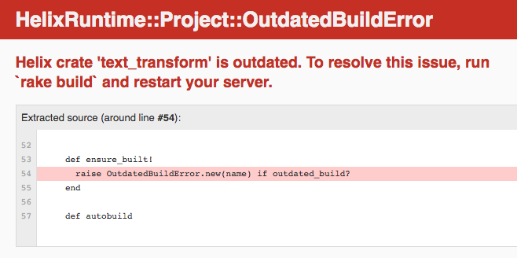

<div class="clearfix mxn2">
  <h2 class="col-8 px2 mx-auto">Getting Started</h2>

  <div class="col-8 px2 mx-auto column-item">
    <h3>Downloading Rust</h3>
    <pre class="language-bash">
      <code class="language-bash">
# Make sure you have Rust installed using rustup.
# https://www.rustup.rs/

# If you already have rustup installed.
$ rustup update

# Use the beta version of Rust.
$ rustup install beta
      </code>
    </pre>
  </div>

  <div class="col-8 px2 mx-auto column-item">
    <h3>Building Helix Textify Rails</h3>

    <p>The best way to see how useful and powerful Helix can be is by seeing it in action.</p>
    <p>
      Let's walk through how to build a simple Rails app, which leverages the speed of Rust by implementing Helix!
      We won't do anything too fancy—to start, our app will just take some text, and transform it.
    </p>
  </div>

  <div class="col-8 px2 mx-auto column-item">
    <p>First, we'll need a new rails project.</p>
    <pre class="language-bash">
      <code class="language-bash">
$ rails new helix-textify-rails
      </code>
    </pre>

    <p>Next, we'll add a very simple <code>TextTransform</code> model, which will implement <code class="language-ruby">widen</code>, <code class="language-ruby">narrow</code>, and <code class="language-ruby">flip</code> methods.</p>

    <pre class="language-ruby">
```
# app/models/text_transform.rb

class TextTransform
  attr_accessor :content

  def initialize(content)
    @content = content
  end

  def widen
    new_string = ""

    content.each_char do |c|
      new_string += widen_map[c] ? widen_map[c] : c
    end

    new_string
  end

  def narrow
    # narrows the contents of a string
  end

  def flip
    # flips the contents of a string
  end

  private

  def widen_map
    {
      ' ' => '  ', '!' => '！', '"' => '＂', '#' => '＃', '$' => '＄', '%' => '％', '&' => '＆', '\'' => '＇',
      '(' => '（', ')' => '）', '*' => '＊', '+' => '＋', ',' => '，', '-' => '－', '.' => '．', '/' => '／',
      '0' => '０', '1' => '１', '2' => '２', '3' => '３', '4' => '４', '5' => '５', '6' => '６', '7' => '７',
      '8' => '８', '9' => '９', ':' => '：', ';' => '；', '<' => '＜', '=' => '＝', '>' => '＞', '?' => '？',
      '@' => '＠', 'A' => 'Ａ', 'B' => 'Ｂ', 'C' => 'Ｃ', 'D' => 'Ｄ', 'E' => 'Ｅ', 'F' => 'Ｆ', 'G' => 'Ｇ',
      'H' => 'Ｈ', 'I' => 'Ｉ', 'J' => 'Ｊ', 'K' => 'Ｋ', 'L' => 'Ｌ', 'M' => 'Ｍ', 'N' => 'Ｎ', 'O' => 'Ｏ',
      'P' => 'Ｐ', 'Q' => 'Ｑ', 'R' => 'Ｒ', 'S' => 'Ｓ', 'T' => 'Ｔ', 'U' => 'Ｕ', 'V' => 'Ｖ', 'W' => 'Ｗ',
      'X' => 'Ｘ', 'Y' => 'Ｙ', 'Z' => 'Ｚ', '[' => '［', '\\' => '＼', ']' => '］', '^' => '＾', '_' => '＿',
      '`' => '｀', 'a' => 'ａ', 'b' => 'ｂ', 'c' => 'ｃ', 'd' => 'ｄ', 'e' => 'ｅ', 'f' => 'ｆ', 'g' => 'ｇ',
      'h' => 'ｈ', 'i' => 'ｉ', 'j' => 'ｊ', 'k' => 'ｋ', 'l' => 'ｌ', 'm' => 'ｍ', 'n' => 'ｎ', 'o' => 'ｏ',
      'p' => 'ｐ', 'q' => 'ｑ', 'r' => 'ｒ', 's' => 'ｓ', 't' => 'ｔ', 'u' => 'ｕ', 'v' => 'ｖ', 'w' => 'ｗ',
      'x' => 'ｘ', 'y' => 'ｙ', 'z' => 'ｚ', '{' => '｛', '|' => '｜', '}' => '｝', '~' => '～'
    }
  end
end
```
    </pre>

    <p>We'll also need a <code>TextTransform</code> controller.</p>

    <pre class="language-ruby">
      <code class="language-ruby">
# app/controllers/text_transform_controller.rb

class TextTransformController
  def index
  end

  def transform
    if params[:widen]
      transformed_text = TextTransform.new(params[:content]).widen
    elsif params[:narrow]
      transformed_text = TextTransform.new(params[:content]).narrow
    elsif params[:flip]
      transformed_text = TextTransform.new(params[:content]).flip
    end

    render json: transformed_text
  end
end
      </code>
    </pre>

    <p>In our view, we'll have a form with an input field, with three different <code class="language-html">submit_tag</code>s, each of which will <code class="language-ruby">POST</code> to a <code class="language-ruby">transform_path</code>, with either a <code class="language-ruby">widen</code>, <code class="language-ruby">narrow</code>, or <code class="language-ruby">flip</code> param.</p>

   <p>When we run our Rails server, we'll see something that looks like this:</p>
    <div class="getting-started-image-container">
      
    </div>
  </div>

  <div class="col-8 px2 mx-auto column-item">
    <p>Next, we'll want to integrate Helix and add the <code class="language-ruby">helix-rails</code> gem:</p>
    <pre class="language-ruby">
      <code class="language-ruby">
# Gemfile
source 'https://rubygems.org'

gem 'helix-rails', '0.0.5'
      </code>
    </pre>

    <p>Be sure to run <code class="language-ruby">bundle install</code> afterwards.</p>
  </div>

  <div class="col-8 px2 mx-auto column-item">
    <p>The <code class="language-ruby">helix-rails</code> gem provides us with generators to get started.</p>
    <p>We can run <code class="language-ruby">rails g helix:add_crate text_transform</code>, which creates a Helix <code class="language-bash">crates</code> directory with a <code class="language-bash">/crates/text_transform</code> directory inside of it. This is home to a Rust file, which is where we'll store the Rust implementation of our current Ruby code.</p>

    <p>Let's take a look at that Rust file:</p>
    <pre class="language-rust">
      <code class="language-rust">
// in /crates/text_transform/src/lib.rs

#[macro_use]
extern crate helix_runtime as helix;

// declare_types! {
//     class MyClass {
//         def hello(&self) {
//             println!("Hello!");
//         }
//     }
// }
      </code>
    </pre>

    <p>This is where we'll re-implement our Ruby code in Rust!</p>
    <p>We'll start by adding a widen method, which we can denote as an instance method by passing in <code class="language-rust">&self</code>:</p>
    <pre class="language-rust">
  ```

  #[macro_use]
  extern crate helix_runtime as helix;

  declare_types! {
      class TextTransform {
          def widen(&self, text: String) -> String {
          }
      }
  }
  ```
    </pre>

    <p>Then, we can re-implement our Ruby <code class="language-ruby">widen</code> method:</p>

    <pre class="language-rust">
```

#[macro_use]
extern crate helix_runtime as helix;

declare_types! {
    class TextTransform {
        def widen(&self, text: String) -> String {
            text.chars().map(|char| {
                match char {
                    ' ' => '\u{3000}', '!' => '！', '"' => '＂', '#' => '＃', '$' => '＄', '%' => '％', '&' => '＆', '\'' => '＇',
                    '(' => '（', ')' => '）', '*' => '＊', '+' => '＋', ',' => '，', '-' => '－', '.' => '．', '/' => '／',
                    '0' => '０', '1' => '１', '2' => '２', '3' => '３', '4' => '４', '5' => '５', '6' => '６', '7' => '７',
                    '8' => '８', '9' => '９', ':' => '：', ';' => '；', '<' => '＜', '=' => '＝', '>' => '＞', '?' => '？',
                    '@' => '＠', 'A' => 'Ａ', 'B' => 'Ｂ', 'C' => 'Ｃ', 'D' => 'Ｄ', 'E' => 'Ｅ', 'F' => 'Ｆ', 'G' => 'Ｇ',
                    'H' => 'Ｈ', 'I' => 'Ｉ', 'J' => 'Ｊ', 'K' => 'Ｋ', 'L' => 'Ｌ', 'M' => 'Ｍ', 'N' => 'Ｎ', 'O' => 'Ｏ',
                    'P' => 'Ｐ', 'Q' => 'Ｑ', 'R' => 'Ｒ', 'S' => 'Ｓ', 'T' => 'Ｔ', 'U' => 'Ｕ', 'V' => 'Ｖ', 'W' => 'Ｗ',
                    'X' => 'Ｘ', 'Y' => 'Ｙ', 'Z' => 'Ｚ', '[' => '［', '\\' => '＼', ']' => '］', '^' => '＾', '_' => '＿',
                    '`' => '｀', 'a' => 'ａ', 'b' => 'ｂ', 'c' => 'ｃ', 'd' => 'ｄ', 'e' => 'ｅ', 'f' => 'ｆ', 'g' => 'ｇ',
                    'h' => 'ｈ', 'i' => 'ｉ', 'j' => 'ｊ', 'k' => 'ｋ', 'l' => 'ｌ', 'm' => 'ｍ', 'n' => 'ｎ', 'o' => 'ｏ',
                    'p' => 'ｐ', 'q' => 'ｑ', 'r' => 'ｒ', 's' => 'ｓ', 't' => 'ｔ', 'u' => 'ｕ', 'v' => 'ｖ', 'w' => 'ｗ',
                    'x' => 'ｘ', 'y' => 'ｙ', 'z' => 'ｚ', '{' => '｛', '|' => '｜', '}' => '｝', '~' => '～', _ => char,
                }
            }).collect()
        }

```
    </pre>

    <p>Since we now have our Rust implementation ready to go, we can remove our Ruby implementation of this entirely. This means that our Rails model now looks much simpler:</p>

      <pre class="language-ruby">
        <code class="language-ruby">
  # app/models/text_transform.rb

  class TextTransform
  end
        </code>
      </pre>

      <p>We'll have these methods available to us through Helix's binding, and since we've named them the same, everything just works. This means that we can call our methods in the same way we did before, just slightly changing how we pass in our content string:</p>

    <pre class="language-ruby">
      <code class="language-ruby">
# app/controllers/text_transform_controller.rb

class TextTransformController
  def index
  end

  def transform
    if params[:widen]
      transformed_text = TextTransform.new(params[:content]).widen
    elsif params[:narrow]
      transformed_text = TextTransform.new(params[:content]).narrow
    elsif params[:flip]
      transformed_text = TextTransform.new(params[:content]).flip
    end

    render json: transformed_text
  end
end
      </code>
    </pre>

    <p>We're finally ready to run Rust in our Rails application!</p>
    <p>When we go back to our application and refresh the page, however, we run into this error:</p>

    <div class="getting-started-image-container">
      
    </div>
  </div>


  <div class="col-8 px2 mx-auto column-item">
    <p>This just means that we need to recompile our Rust code!</p>
    <p>If we run <code class="language-ruby">rake build</code> and restart our Rails server, we should see our app load as expected. Let's try widening some text:</p>

    <div class="getting-started-image-container">
      
    </div>
  </div>

  <div class="col-8 px2 mx-auto column-item">
    <p>When we submit our form, the widened string that is returned to us comes from our Helix !</p>
    <div class="getting-started-image-container">
      
    </div>
  </div>

  <div class="col-8 px2 mx-auto column-item">
    <p>With Helix, you can use the same Ruby classes that you know and love, but in Rust, and without having to write the glue yourself!</p>
    <p>You can view live the demo Helix text transform app <a href="https://github.com/tildeio/helix-textify-rails" target="_blank">here</a>.</p>

    <p>If you'd like to use Helix in your own project, check out our <a href="/documentation">documentation</a>.</p>
  </div>
</div>
